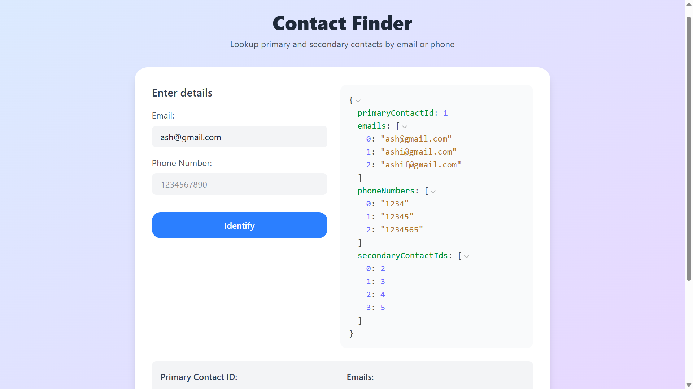
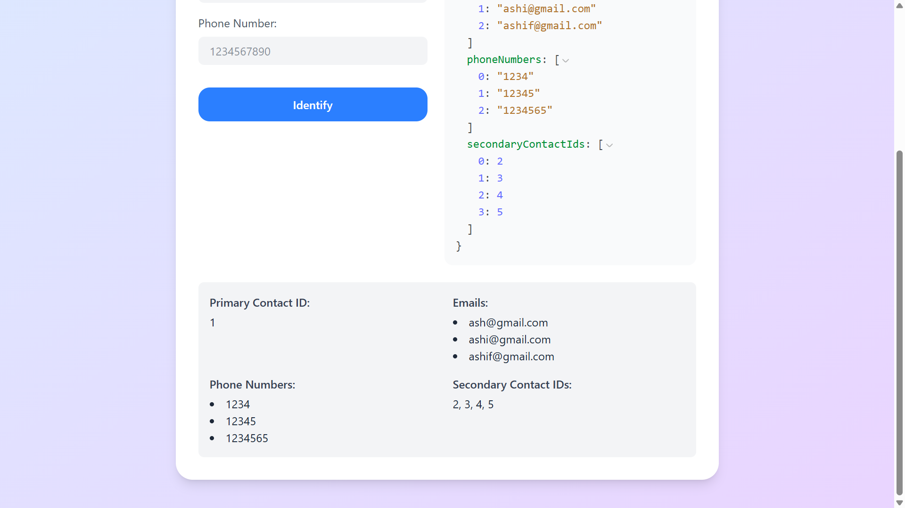
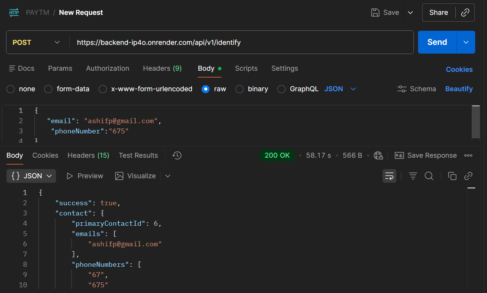
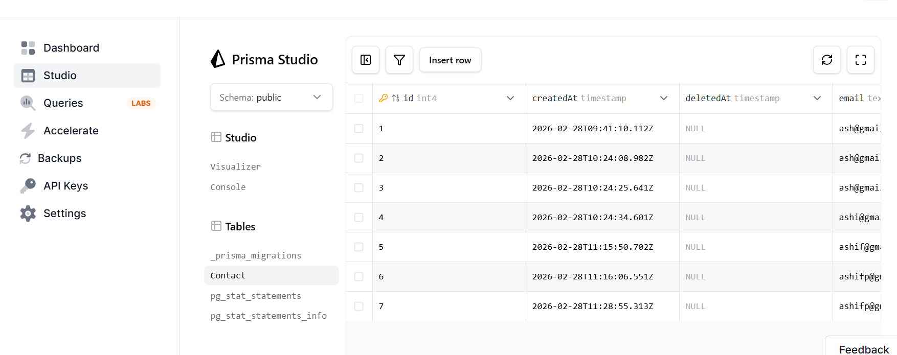

# Bitespeed Contact Identifier

This repository contains a **full-stack application** for identifying contact information using an email or phone number. The backend exposes a REST API and the frontend provides a clean UI built with React and Tailwind CSS.

## 🔗 Live Links
- **Backend API**: [https://backend-ip4o.onrender.com/api/v1/identify](https://backend-ip4o.onrender.com/api/v1/identify)
- **Frontend Application**: [https://bitespeed-zsqx.onrender.com](https://bitespeed-zsqx.onrender.com)

## 📁 Project Structure
```
backend/      ← Node/TypeScript API with Prisma, controllers, routes
frontend/     ← React + Vite client using Tailwind CSS
assets/       ← Screenshots illustrating usage of the app
```

## 🚀 Features
- Submit an email or phone number through the frontend form.
- Backend queries a database for matching contacts and returns:
  - Primary contact ID
  - Associated emails and phone numbers
  - Secondary contact IDs
- Results are displayed in a formatted JSON view and also broken out into sections.

## 🛠 Technologies
- **Backend**: Node.js, Express, TypeScript, Prisma, PostgreSQL
- **Frontend**: React, TypeScript, Vite, Tailwind CSS
- **Utilities**: Axios, react18-json-view

## 📸 Screenshots
Below are some example screenshots from the `assets/` folder:









*(Images show the form, sample results, Postman call, and database schema.)*

## 💡 Usage
1. Clone the repo:
   ```bash
   git clone https://github.com/yourusername/bitespeed.git
   cd bitespeed
   ```
2. Start the backend and frontend (see respective README files for details).
3. Visit the live frontend link or run locally at `http://localhost:3000` (or configured port).
4. Enter an email or phone number and click "Identify" to see the contact details.

## 📄 Notes
- The API base URL is stored in the frontend environment variable `VITE_BASE_URL`.
- Tailwind CSS is used heavily for styling; feel free to customize the theme.

---

Thank you for checking out Bitespeed! Feel free to contribute or raise issues.
